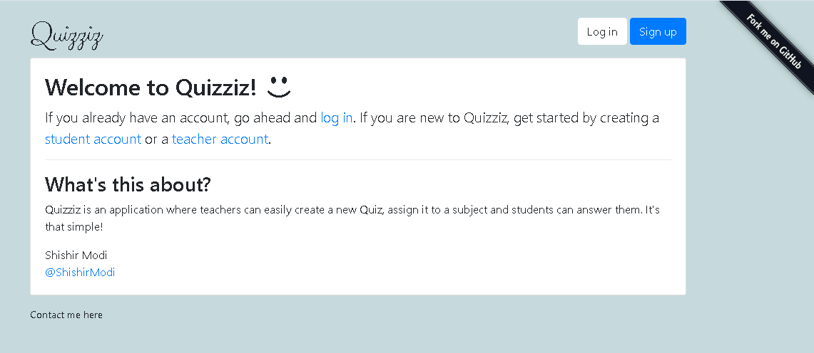

# Quizziz

In this Django app, teachers can create quizzes and students can sign up and take quizzes related to their interests.



## Running the Project Locally

First, clone the repository to your local machine:

```bash
git clone https://github.com/ShishirModi/Quizziz.git
```

Install the requirements:

```bash
pip install -r requirements.txt
```

Create the database:

```bash
python manage.py migrate
```

Finally, run the development server:

```bash
python manage.py runserver
```

The project will be available at **127.0.0.1:8000**.

## Example Logins

- Student Login
    * Username: Student
    * Password: ExamplE@987

- Teacher Login
    * Username: Teacher
    * Password: ExamplE@987